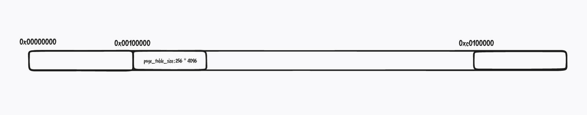

我嫌作者写的 makefile 写的丑，自己学了下，写出来就是文件夹中的效果，其实我仍旧觉得丑，反而是作者的 makefile 比较清晰易懂，我认为好的makefile 足够简单，代码量少。这里只是一个很小的项目，头文件和源文件散落在各个文件夹中，我没法想象大型项目会怎样。

最终效果`make all`即可重新生成 `image`。


**浅谈内存管理？**

> 我希望这里的内容能够尽量简单，理解一个作者所说内存管理系统


这一节的重点是理解**内存管理**。

保护模式下，处理器分两步进行地址转换得到最后的**物理地址**：

* **逻辑地址**转换机制
* **线性地址**空间的分页机制

这个过程需要一些运算，为了提高效率，将这部分运算由硬件完成，这个硬件名为 MMU （Memory Management Unit)。

MMU 包含两个部件，段部件和页部件，**段部件负责把逻辑地址转换为线性地址，页部件负责把线性地址转换为物理地址。**


具体的机制这里简单描述。。。blabla ..


内存管理系统中最重要的两个问题：**分配和释放**

分配和释放的是内存，就需要表示内存，这里使用位图来映射内存：

```c
struct bitmap {
   uint32_t btmp_bytes_len;
   uint8_t* bits;
};
```

所谓的位图映射内存，就是每 1 字节含有 8 位，每一位对应物理内存的 4KB ，每一位有两种状态，0 表示未分配，1 表示已分配。

使用字节数组就能够表示内存，内存的大小操作系统未知，这个字节数组的长度也未知，所以这里定义了两个成员：

* `btmp_bytes_len`：字节数组的长度
* `bits`：字节数组的位置

分配内存需要分配的页数量，分配的过程即在字节数组中寻找位为 0 然后设置为 1 的过程。

释放内存需要释放的字节数组索引号、释放页数量，释放的过程即在字节数组将对应的位设置为 0 的过程。

因此有了以下几个函数：

```c
void bitmap_init(struct bitmap* btmp); 
//初始化 bitmap ，将bitmap 表示的字节数组全部设置为 0 
bool bitmap_scan_test(struct bitmap* btmp, uint32_t bit_idx); 
//测试 bitmap 的 bit_idx 位是否为 1，为 1 返回 true,否则返回fase 
int bitmap_scan(struct bitmap* btmp, uint32_t cnt);
//在 bitmap 表示的字节数组中连续设置 cnt 位，成功返回下标，失败返回 -1 
void bitmap_set(struct bitmap* btmp, uint32_t bit_idx, int8_t value);
//将bitmap 中的 bit_idx 设置位 value 
```

> 这里不会过多谈具体的实现，实现过程请看源码。

这几个函数就可以实现内存分配和释放。

* 初始化：使用`bitmap_init`初始化字节数组即可
* 分配：使用`bitmap_scan`在字节数组中申请任意页数量的内存，申请成功后使用`bitmap_set`标记为已使用(设置为 1)
* 释放：使用`bitmap_set`在字节数组将标记为未使用(设置为 0)





几个内存结构blablabla ..
